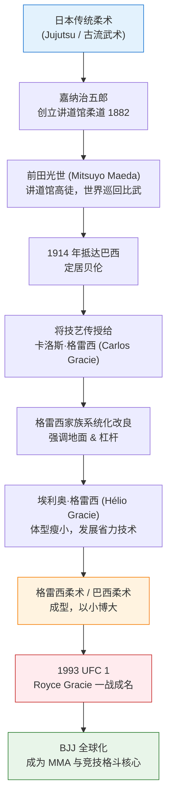
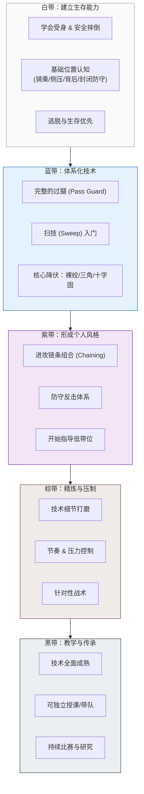
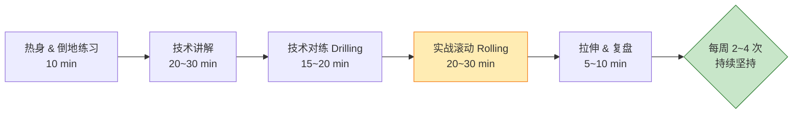
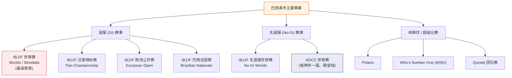
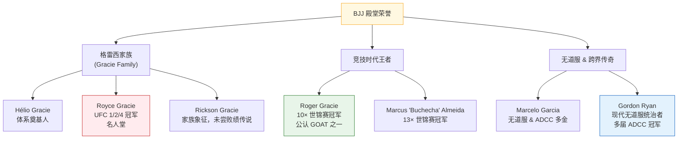

# 巴西柔术（Brazilian Jiu-Jitsu, BJJ）全景图

> 以流程图叙事为主，串联「历史脉络 → 学习路线 → 主要赛事 → 主要荣誉」四大主题。

---

## 一、历史脉络：从日本柔术到巴西柔术

**叙事要点**
- 源头是日本古流柔术，经柔道之父嘉纳治五郎体系化。
- 前田光世（巴西人称 "Conde Koma"）将技艺带到巴西。
- 格雷西家族（尤其埃利奥）针对小个子、弱体型做了"省力化"改造，催生了重地面缠斗的风格。
- 1993 年首届 UFC 让世界见识到 BJJ 以弱胜强的威力，从此风靡全球。

---

## 二、学习路线：从白带到黑带的进阶之路

### 各阶段能力地图

### 每周训练建议（初学者节奏）

---

## 三、主要赛事：竞技舞台地图

**叙事要点**
- **IBJJF 世锦赛**：道服体系的"奥运会"，含金量最高。
- **ADCC**：无道服顶级赛事，两年一届，被誉为格斗界的世界杯，竞争极其残酷。
- **超级比赛 (Superfights)**：近年兴起的商业化、观赏性赛事，推动 BJJ 出圈。

---

## 四、主要荣誉与传奇人物

**叙事要点**
- **格雷西家族**：BJJ 的源头与精神图腾，Royce 用实战证明了体系价值。
- **Roger Gracie / Buchecha**：道服竞技时代的统治者，世锦赛金牌最多的代表。
- **Gordon Ryan**：无道服时代的统治级人物，把现代缠斗体系推向新高度。

---

## 五、整体旅程总览

---

> 注：腰带晋升年限因个人天赋、训练频率与流派而异，以上为通用参考。BJJ 强调"功夫不负有心人"，坚持上垫子（mat time）才是核心。
